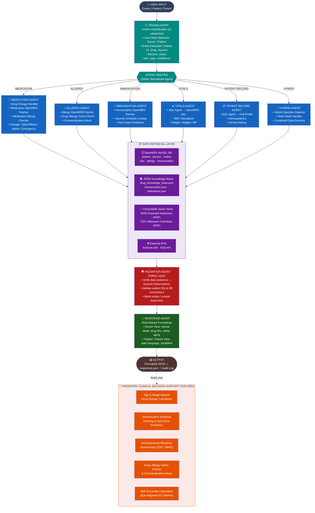

# OpenMRS Clinical Chatbot – Architecture Flowcharts

Three flowcharts are provided below. PNG images (high-resolution, 150 dpi) are also
available alongside this file and can be regenerated at any time with:

```bash
python docs/flowcharts/generate_flowcharts.py
```

---

## Flowchart 1 — OpenMRS Clinical Chatbot: An Intelligent Agent-Based Architecture for Pediatric Clinical Decision Support

> Traces the full processing pipeline from raw user input through the multi-agent
> system to the final, role-aware clinical response.

📄 High-resolution PNG: [`flowchart1_agent_architecture.png`](flowchart1_agent_architecture.png)



---

## Flowchart 2 — OpenMRS-Integrated Chatbot for Pediatric Care: A Knowledge-Source Framework for Clinical Query Scenario Classification

> Shows how each of the 11 clinical query scenario categories is mapped to its
> primary knowledge source(s) within the OpenMRS-integrated chatbot.

📄 High-resolution PNG: [`flowchart2_knowledge_classification.png`](flowchart2_knowledge_classification.png)

```mermaid
flowchart TD
    Q(["💬 CLINICAL QUERY\n(Natural Language Input)"])

    Q --> T["🔍 TRIAGE AGENT\nKeyword Matching  •  LLM (Ollama / llama2)  •  Confidence Scoring"]

    T --> CL["🎯 CLINICAL QUERY SCENARIO CLASSIFIER\nReturns: intent · user_role · patient_id · confidence"]

    CL --> CATS["QUERY SCENARIO CATEGORIES"]

    CATS --> M1["MEDICATION_QUERY\nDrug dosage, side effects, dosing frequency"]
    CATS --> M2["MEDICATION_INFO_QUERY\nCurrent prescribed medications for patient"]
    CATS --> M3["MEDICATION_ADMINISTRATION_QUERY\nHow to administer / give a medication"]
    CATS --> M4["MEDICATION_SIDE_EFFECTS_QUERY\nAdverse effects, toxicity, reactions"]
    CATS --> M5["⚠️ MEDICATION_EMERGENCY_QUERY\nOverdose, missed dose — HIGH PRIORITY"]
    CATS --> M6["MEDICATION_COMPATIBILITY_QUERY\nDrug–drug interactions, simultaneous use"]
    CATS --> AL["ALLERGY_QUERY\nDrug-allergy contraindication checks"]
    CATS --> IM["IMMUNIZATION_QUERY\nVaccination history, next dose, schedules"]
    CATS --> VI["VITALS_QUERY\nVital signs, BMI, weight, height, BP"]
    CATS --> PR["PATIENT_RECORD_QUERY\nFull demographic & clinical profile"]
    CATS --> HY["HYBRID_QUERY\nMulti-intent — combined knowledge sources"]

    M1 & M3 & M4 & M5 & M6 -->|"Primary"| KS2["📚 JSON Knowledge Bases\ndrug_knowledge_base.json\n• Indications & dosing\n• Paediatric mg/kg doses\n• Contraindications\n• Drug interactions"]
    M2 & AL & VI & PR -->|"Primary"| KS1["🗄️ OpenMRS MySQL DB\norders  – active medications\nallergy – allergies + severity\nobs     – vitals\npatient – demographics"]
    IM -->|"Primary"| KS1
    IM -->|"Secondary"| KS2b["📚 immunization.json\nVaccine schedules\nDose intervals"]
    M5 & M1 -->|"Fallback RAG"| KS3["🔎 ChromaDB Vector Store\nWHO Essential Medicines (PDF)\nCDC Milestone Checklists (PDF)\n(Semantic retrieval)"]
    M5 & M6 -->|"Supplement"| KS4["🌐 External APIs\nRxNorm API – drug concepts\nFDA API   – labelling & recalls"]
    HY -->|"All sources"| KS1
    HY -->|"All sources"| KS2
    HY -->|"All sources"| KS3
    HY -->|"All sources"| KS4

    style Q fill:#2E4057,color:#fff
    style T fill:#00695C,color:#fff
    style CL fill:#1565C0,color:#fff
    style CATS fill:#37474F,color:#fff
    style M1 fill:#1565C0,color:#fff
    style M2 fill:#1565C0,color:#fff
    style M3 fill:#1565C0,color:#fff
    style M4 fill:#1565C0,color:#fff
    style M5 fill:#C62828,color:#fff
    style M6 fill:#1565C0,color:#fff
    style AL fill:#6A1B9A,color:#fff
    style IM fill:#00838F,color:#fff
    style VI fill:#4527A0,color:#fff
    style PR fill:#37474F,color:#fff
    style HY fill:#E65100,color:#fff
    style KS1 fill:#6A1B9A,color:#fff
    style KS2 fill:#00838F,color:#fff
    style KS2b fill:#00838F,color:#fff
    style KS3 fill:#4527A0,color:#fff
    style KS4 fill:#558B2F,color:#fff
```



---

## Knowledge Source → Query Scenario Mapping Summary

| Knowledge Source | Primary Query Scenarios |
|---|---|
| **OpenMRS MySQL DB** | `MEDICATION_INFO_QUERY`, `ALLERGY_QUERY`, `IMMUNIZATION_QUERY`, `VITALS_QUERY`, `PATIENT_RECORD_QUERY`, `HYBRID_QUERY` |
| **drug_knowledge_base.json** | `MEDICATION_QUERY`, `MEDICATION_ADMINISTRATION_QUERY`, `MEDICATION_SIDE_EFFECTS_QUERY`, `MEDICATION_EMERGENCY_QUERY`, `MEDICATION_COMPATIBILITY_QUERY` |
| **immunization.json** | `IMMUNIZATION_QUERY` (schedule lookup) |
| **milestones.json** | Developmental milestone queries (part of `PATIENT_RECORD_QUERY` / `HYBRID_QUERY`) |
| **ChromaDB (WHO / CDC PDFs)** | `MEDICATION_QUERY` fallback, `MEDICATION_EMERGENCY_QUERY`, `HYBRID_QUERY` |
| **RxNorm API** | `MEDICATION_COMPATIBILITY_QUERY`, `HYBRID_QUERY` |
| **FDA API** | `MEDICATION_EMERGENCY_QUERY`, `MEDICATION_COMPATIBILITY_QUERY`, `HYBRID_QUERY` |

---

## Regenerating the PNG Images

```bash
# From the repository root
pip install matplotlib pillow   # only needed once
python docs/flowcharts/generate_flowcharts.py
```

Output files:
- `docs/flowcharts/flowchart1_agent_architecture.png`
- `docs/flowcharts/flowchart2_knowledge_classification.png`
- `docs/flowcharts/flowchart3_architecture_flow.png`

---

## Flowchart 3 — OpenMRS Clinical Chatbot System: Architecture, Flow, and Safety Logic

> A horizontal 7-module pipeline diagram.
>
> **Fixes applied** vs. the reference image:
> 1. **All arrows drawn** — modules 4 → 5, 5 → 6, 6 → 7, and every query-type box → module 4 all have explicit connecting arrows.
> 2. **"4. Data Retrieval Layer" title is inside its container box** — was incorrectly floating below the box in the original.
> 3. **Uniform styling** — identical header treatment, consistent box borders, font sizes, and arrow weights across all 7 modules.

📄 High-resolution PNG: [`flowchart3_architecture_flow.png`](flowchart3_architecture_flow.png)

```mermaid
flowchart LR
    A(["1. User Input\n(Natural Language)\nDoctor | Patient | Parent"])

    A -->|"1 → 2"| B["2. Triage Agent\n(Intent Classification)\n• Classifies query intent (11 types)\n• Detects user role: doctor / patient\n• Extracts patient ID, drug/vaccine names\n• Returns: user_type, intent, patient_id, confidence"]

    B -->|"3. Intent\nRouting"| C1["Medication Query\nDrug Dosage Handler\nMedication Allergy Checker"]
    B --> C2["Allergy Query\nMedication Allergy Checker"]
    B --> C3["Immunization Query\nImmunization Status Handler"]
    B --> C4["Vitals Query\nVitals Trend Handler"]
    B --> C5["Patient Record Query\nRecord Summary Handler"]
    B --> C6["Hybrid Query\nHybrid Handler"]

    C1 & C2 & C3 & C4 & C5 & C6 -->|"→ 4"| D

    subgraph D["4. Data Retrieval Layer"]
        D1["JSON MCP DBs\n(Knowledge Base)\nDrug KB • Immunization KB • Milestones KB"]
        D2["ChromaDB Vector Store\n(PDF Guidelines)\nWHO Medicines • CDC Milestone Checklists"]
        D3["Knowledge Agent\n(Semantic Search)\nEmbeds queries • Returns relevant passages"]
    end

    D -->|"4 → 5"| E["5. Validation Agent\n(Safety Layer)\n• Verifies data exists\n• Prevents hallucination\n• Checks database connectivity\n• Validates patient IDs\n• Ensures no empty response"]

    E -->|"5 → 6"| F

    subgraph F["6. Response Agent\n(Formatting by Role)"]
        F1["Doctor Response\nClinical detail, IDs, safety notes, professional look"]
        F2["Patient Response\nSimplified language, parent-friendly, soft color accent"]
    end

    F -->|"6 → 7"| G(["7. User Output\n(Formatted)\n• Saved to responses.json\n• Logged for audit trail"])

    style A fill:#EBF5FB,stroke:#1565C0
    style B fill:#EBF5FB,stroke:#1565C0
    style C1 fill:#AED6F1,stroke:#1565C0
    style C2 fill:#FAD7A0,stroke:#E67E22
    style C3 fill:#A9DFBF,stroke:#27AE60
    style C4 fill:#D2B4DE,stroke:#7D3C98
    style C5 fill:#FADBD8,stroke:#CB4335
    style C6 fill:#A3E4D7,stroke:#17A589
    style D fill:#EBF5FB,stroke:#1565C0
    style D1 fill:#D6EEF8,stroke:#1565C0
    style D2 fill:#D6EEF8,stroke:#1565C0
    style D3 fill:#D6EEF8,stroke:#1565C0
    style E fill:#EBF5FB,stroke:#1565C0
    style F fill:#EBF5FB,stroke:#1565C0
    style F1 fill:#DBEAFE,stroke:#1565C0
    style F2 fill:#FAD7A0,stroke:#E67E22
    style G fill:#EBF5FB,stroke:#1565C0
```


